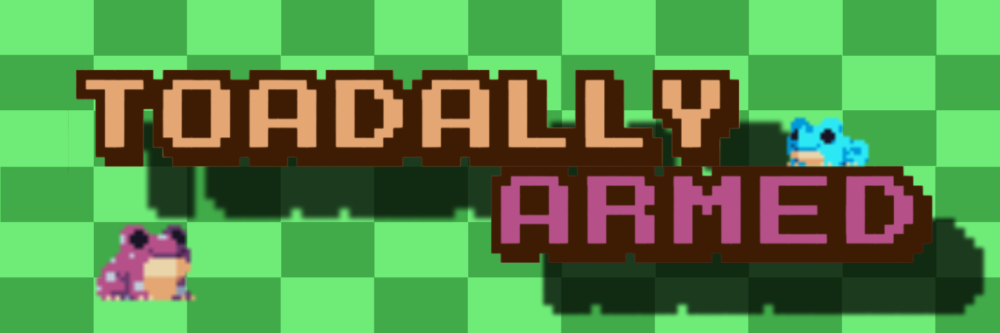

The frogs were minding their own business — sipping fly-leg tea by the pond — when suddenly, bloodthirsty beasts attacked. Hedgehogs. And not just any hedgehogs, but Tuesday-loving, frog-brain-craving monsters.

But these weren’t just any frogs. No, these were the Avengers of the Pond, the Fellowship of Zakrzówek Forest, the Black Order guarding the Great Wall between trees and traffic. Wizards, knights, shieldmaidens — each frog unique, battle-ready, and fabulous.

Still, what’s an epic campaign without a bard to tell the tale, earn a few coins, and ensure the legend lives forever? And so, the frogs leapt into battle to defend their tadpoles, etching their saga into the annals of history — and into the repository of our OOP project.

🎮 Toadally Armed is a cozy, pixel-art strategy game that lovingly recycles the iconic “Plants vs. Zombies” concept — but with frogs. Lots of frogs. Armed frogs.
